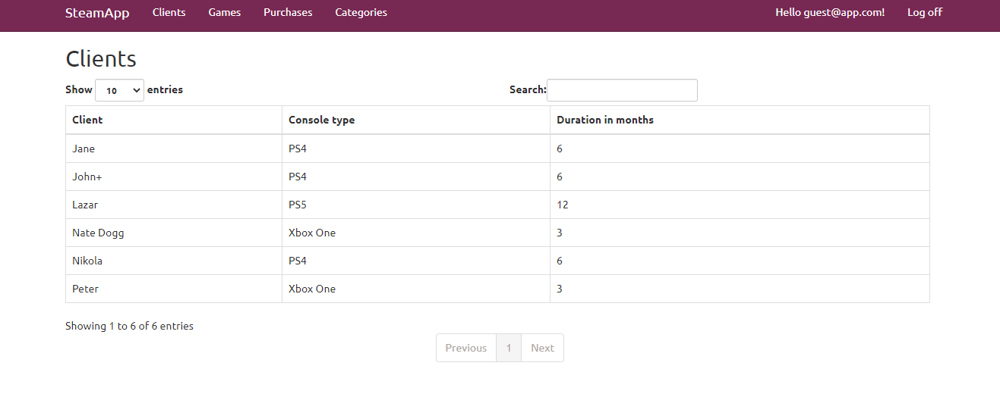

# ASP.NET MVC Application managing clients, games and purchases that clients have made.

## Tehnologies used: 
  - Code-first Entity Framework (ASP.NET MVC)
  - ASP.NET Web API
  - AJAX
  - AutoMapper
  - ASP.NET Identity (diffrent roles for admin, manager, guest and  anonymous users)
  
  CRUD functionalities for Games
 
 
 Guests can see and search data but can't perform CRUD operations (only admin can). 
 
 
